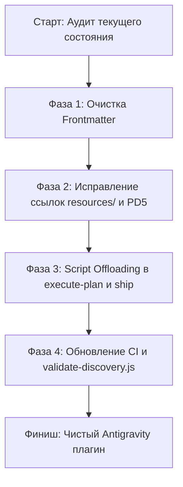

# Анализ формата Skills и план миграции на чистый Antigravity-формат

> **⚠️ СТАТУС: ЧАСТИЧНО УСТАРЕЛО / ЗАМЕНЕНО — не выполнять как написано.**
> Проверено против рабочего дерева 10.09.2026 (Wave 7 плана `learn-sdlc`). Итог: **Этап 2 (Action 2)** —
> единственная часть, которая была реально нужна и уже выполнена. Остальное отклонено:
>
> - **Этап 1 (удалить `user-invocable` / `argument-hint` из всех SKILL.md) — ОТКЛОНЕНО.** Это не требование
>   спецификации: `agy plugin validate .` возвращает 0 с этими полями, а `docs/plugin-api-specs.md:198-199`
>   прямо называет их "additive, not load-bearing". Более того, удаление `user-invocable: false` из
>   `skills/error-report-sdlc/SKILL.md:4` сделало бы внутренний скилл вызываемым пользователем в Claude Code —
>   это регресс поведения, а не выравнивание.
> - **Этап 2, Action 1 (префикс `resources/` для `REFERENCE.md`) — УЖЕ СДЕЛАНО** во всех трёх скиллах.
>   Ошибку давал сам валидатор; исправлено в `scripts/lib/discovery.js` (Task 14) + `npm run check:discovery`.
> - **Этап 3 (offloading / сокращение размера) — ВНЕ ОБЛАСТИ.** Это инициатива по токенам, а не по
>   выравниванию с Antigravity; ведётся отдельно в `docs/optimizations/skill-optimization-plan.md`.
> - **Этап 4 (добавить `agy` в `.github/workflows/ci.yml`) — ССЫЛАЕТСЯ НА НЕСУЩЕСТВУЮЩИЙ ФАЙЛ.**
>   В репозитории нет `.github/workflows/` и нет GitHub Actions CI вообще.
>
> **Важно (проверено эмпирически):** `agy plugin validate` — это **счётчик обнаружения, а не валидатор схемы**.
> Плагин с фиктивным полем frontmatter и агентом с `tools: Read, Write, Bash` / `model: gpt-4` тоже даёт exit 0.
> Зелёный `check:plugin` доказывает только, что файлы разбираются и находятся.
>
> Что действительно оставалось и было сделано в Wave 7: 7 мест в prose с Claude-именами инструментов
> (Task 13) + баг разрешения пути PD5 (Task 14). Подробности — в разделе "Wave 7" плана
> `2026-09-10-learn-sdlc-self-learning-loop.md`.

> **Статус:** Аналитический отчет и план миграции  
> **Дата:** 10 сентября 2026 г.  
> **Целевая платформа:** Google Antigravity CLI (Gemini 3.8 / Gemini SDK)  
> **Исходная кодовая база:** `lift-sdlc` v0.21.0  

---

## 1. Executive Summary

Плагин `lift-sdlc` исторически развивался как решение с **dual-host архитектурой**: базовая структура плагина, соглашения по именованию файлов и форматы YAML frontmatter были унаследованы от конвенции **Claude Code (Anthropic)**, но целевой рантайм, инструменты (`tools`) и модели выполнения были адаптированы под **Google Antigravity CLI** (`gemini-3.8-flash-*`).

Хотя текущая реализация функциональна (тестовый набор 843/843 проходит успешно), наличие артефактов Claude Code приводит к:
1. **Информационному шуму в контексте:** поля `user-invocable`, `argument-hint` и перегруженные блоки `Triggers on: ...` не используются ядром Antigravity и раздувают размер системных инструкций.
2. **Ошибкам валидации discovery:** чекер `validate-discovery.js` фиксирует сбой `PD5` из-за расхождения путей к `resources/REFERENCE.md`.
3. **Завышенному TTFT (Time To First Token):** оркестраторы `execute-plan-sdlc` (~75 KB) и `ship-sdlc` (~64 KB) перегружены shell-инструкциями, которые в экосистеме Antigravity эффективнее делегировать детерминированным CLI-скриптам.

Переход на **чистый Antigravity-формат** стандартизирует кодовую базу под официальную спецификацию Antigravity Customization System, снизит затраты токенов и упростит поддержку плагина.

---

## 2. Анализ расхождений: Текущий гибрид vs Чистый Antigravity

| Аспект | Текущее состояние (Гибрид) | Чистый Antigravity-формат | Влияние / Риски |
|---|---|---|---|
| **Схема плагина (`plugin.json`)** | Содержит `$schema`, `name`, `description`, `version`, `author` | Спецификация Antigravity формально требует `name`, опционально `description` и `$schema` | Поля `version` и `author` не валидируются схемой Antigravity, но безвредны |
| **Frontmatter: `user-invocable`** | Присутствует во всех навыках (`true`/`false`) | **Отсутствует**. В Antigravity все навыки в `skills/` становятся slash-командами по факту обнаружения | Игнорируется рантаймом Antigravity, тратит токены |
| **Frontmatter: `argument-hint`** | Присутствует строка аргументов для CLI автокомплита | **Отсутствует**. Antigravity выводит сигнатуру команды на основе описания и контекста | Игнорируется рантаймом Antigravity |
| **Frontmatter: `description`** | Содержит длинный список ключевых фраз `Triggers on: ...` | Строгое описание от 3-го лица: *"Use this skill when the user wants to..."* | Antigravity Progressive Disclosure загружает только `description` для маршрутизации |
| **Frontmatter: `model`** | `gemini-3.8-flash-low/medium/high` | Поддерживается Antigravity, рекомендуется явное сопоставление с профилями задач | Соответствует требованиям, сохраняется |
| **Frontmatter: `disable-model-invocation`** | Используется в `error-report-sdlc` | Поддерживается Antigravity (запрет автономного вызова моделью) | Соответствует требованиям, сохраняется |
| **Топология ресурсов** | Смешанная: часть ссылок на `REFERENCE.md` ищет файл в корне навыка, а он лежит в `resources/` | Строгая структура Antigravity: `skills/<name>/resources/`, `skills/<name>/references/` | Вызывает сбой проверки `PD5` в `validate-discovery.js` |
| **Логика шагов (`SKILL.md`)** | Многословные shell-пайплайны отката git, разрешения конфликтов rebase | Детерминированный Script Offloading: скрипт выполняет git-операции, модель читает JSON-результат | Сокращает размер промпта на 40–60%, устраняет галлюцинации bash |

---

## 3. Детальные рекомендации по миграции

### Этап 1: Очистка YAML Frontmatter во всех 15 навыках

В соответствии со спецификацией Antigravity (`agy-customizations/docs/skills.md`), frontmatter навыка должен содержать только релевантные поля:

#### Было (гибридный формат `commit-sdlc`):
```yaml
---
name: commit-sdlc
description: "Use this skill when committing staged changes, creating a git commit, or generating a commit message. Analyzes staged diff and recent commit history to generate a message matching the project's style. Stashes unstaged changes to isolate the commit, commits after user confirmation, and auto-restores the stash. Arguments: [--no-stash] [--scope <scope>] [--type <type>] [--amend] [--auto] [--force-default-branch]. Use --auto to skip interactive approval. Triggers on: commit changes, create commit, write commit message, git commit, smart commit, commit staged, stage and commit."
user-invocable: true
argument-hint: "[--no-stash] [--scope <scope>] [--type <type>] [--amend] [--auto] [--force-default-branch]"
model: gemini-3.8-flash-medium
---
```

#### Стало (чистый Antigravity-формат):
```yaml
---
name: commit-sdlc
description: >-
  Use this skill when committing staged changes, creating a git commit, or generating
  a commit message matching the project's style. Handles unstaged change isolation via stash,
  pre-commit verification, and optional squashing. Supports arguments: [--no-stash],
  [--scope <scope>], [--type <type>], [--amend], [--auto], [--force-default-branch].
model: gemini-3.8-flash-medium
---
```

**Действия:**
1. Удалить строку `user-invocable: ...` из всех 15 файлов `skills/*/SKILL.md`.
2. Удалить строку `argument-hint: ...` из всех файлов.
3. Очистить `description` от избыточного хвоста `Triggers on: ...`, интегрировав ключевые сценарии естественным языком в повествовательную форму.

---

### Этап 2: Нормализация путей к вспомогательным ресурсам (`PD5 Fix`)

В скиллах `error-report-sdlc`, `jira-sdlc` и `review-sdlc` файлы документации находятся в подкаталоге `resources/` (например, `resources/REFERENCE.md`), но в текстах инструкций и регулярных выражениях валидатора происходят коллизии.

**Действия:**
1. В `skills/error-report-sdlc/SKILL.md`, `skills/jira-sdlc/SKILL.md`, `skills/review-sdlc/SKILL.md` заменить все вхождения относительных ссылок вида `` `REFERENCE.md` `` на явные относительные пути вида `` `resources/REFERENCE.md` `` или Markdown-ссылки `[REFERENCE.md](./resources/REFERENCE.md)`.
2. Обновить парсер ссылок в `scripts/lib/discovery.js` (функцию `checkPD5`):
   ```javascript
   // Поддержка как прямого корня навыка, так и подпапки resources/
   const siblingPath = fs.existsSync(path.join(skillsDir, d, ref))
     ? path.join(skillsDir, d, ref)
     : path.join(skillsDir, d, 'resources', ref);
   ```
3. Проверить успешное прохождение `node scripts/ci/validate-discovery.js` (все 9 проверок должны быть `PASS`).

---

### Этап 3: Реализация Script Offloading (разгрузка промптов)

Сократить размер тяжелых навыков (`execute-plan-sdlc` — 75 KB, `ship-sdlc` — 64 KB) согласно ранее утвержденному `skill-optimization-plan.md`:

1. **Инкапсуляция сложных git-команд:**
   - Перенести циклы проверки веток, git rebase abort/continue, удаление и откат тегов из Markdown-промптов в скрипты `scripts/util/ship-git-ops.js` и `scripts/util/retag-helper.js`.
   - В `SKILL.md` оставить только выполнение одной команды Node.js с чтением JSON-манифеста.
2. **Ликвидация "Defensive Repetition":**
   - Удалить дублирующие списки запретов ("DO NOT", "Gotchas", "Trailing checklist"), если эти правила уже проверяются скриптами или валидаторами в шагах 0–2.
3. **Устранение устаревших ссылок на внутренние issue:**
   - Удалить исторические комментарии вида `Fixes #418`, `Requirement R1`, не несущие ценности для runtime-агента Antigravity.

---

### Этап 4: Настройка валидации и CI для Antigravity

1. **Добавление валидатора Antigravity в CI пайплайн:**
   - Включить запуск `agy plugin validate .` в GitHub Actions (`.github/workflows/ci.yml`).
   - Добавить проверку отсутствия legacy-полей Claude Code в скрипт `scripts/ci/validate-discovery.js` (новый чек `PD10: no-claude-legacy-fields`).
2. **Документирование формата для контрибьюторов:**
   - Обновить `README.md` и `docs/plugin-api-specs.md`, явно указав, что первичным стандартом репозитория является Antigravity Customization Specification.

---

## 4. План реализации по шагам (Roadmap)



### Задачи:
- [ ] **Task 1 (Frontmatter):** Удалить `user-invocable` и `argument-hint` из 15 файлов `skills/*/SKILL.md`. Переформатировать `description`.
- [ ] **Task 2 (Resources):** Исправить пути к `resources/REFERENCE.md` и обновить `scripts/lib/discovery.js`. Добиться статуса `PASS` по `validate-discovery.js`.
- [ ] **Task 3 (Script Offloading):** Оптимизировать `skills/execute-plan-sdlc/SKILL.md` и `skills/ship-sdlc/SKILL.md`, вынеся shell-цепочки в скрипты.
- [ ] **Task 4 (CI/CD):** Добавить проверку `validate-discovery.js` в `npm test` и закрепить стандарт в документации разработчика.

---

## 5. Заключение

Миграция на чистый Antigravity-формат не нарушает существующие сценарии использования, так как Antigravity CLI уже является основной целевой средой для плагина. Удаление рудиментов Claude Code и оптимизация промптов сделают выполнение команд быстрее, дешевле по токенам и полностью совместимым со строгими валидаторами Google Antigravity SDK.
