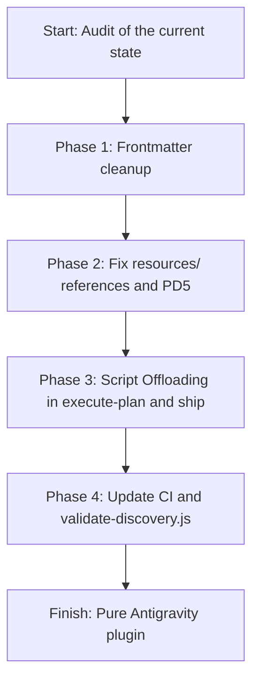

# Analysis of the Skills Format and a Migration Plan to the Pure Antigravity Format

> **⚠️ STATUS: PARTIALLY OBSOLETE / SUPERSEDED — do not execute as written.**
> Checked against the working tree on 10.09.2026 (Wave 7 of the `learn-sdlc` plan). Outcome: **Stage 2 (Action 2)** is
> the only part that was really needed, and it is already done. The rest is rejected:
>
> - **Stage 1 (remove `user-invocable` / `argument-hint` from all SKILL.md files) — REJECTED.** This is not a
>   requirement of the specification: `agy plugin validate .` returns 0 with these fields, and `docs/plugin-api-specs.md:198-199`
>   explicitly calls them "additive, not load-bearing". Moreover, removing `user-invocable: false` from
>   `skills/error-report-sdlc/SKILL.md:4` would make an internal skill user-invocable in Claude Code —
>   that is a behaviour regression, not an alignment.
> - **Stage 2, Action 1 (the `resources/` prefix for `REFERENCE.md`) — ALREADY DONE** in all three skills.
>   The error came from the validator itself; fixed in `scripts/lib/discovery.js` (Task 14) + `npm run check:discovery`.
> - **Stage 3 (offloading / size reduction) — OUT OF SCOPE.** This is a token initiative, not an
>   alignment with Antigravity; it is tracked separately in `docs/optimizations/skill-optimization-plan.md`.
> - **Stage 4 (add `agy` to `.github/workflows/ci.yml`) — REFERS TO A NON-EXISTENT FILE.**
>   The repository has no `.github/workflows/` and no GitHub Actions CI at all.
>
> **Important (verified empirically):** `agy plugin validate` is a **discovery counter, not a schema validator**.
> A plugin with a bogus frontmatter field and an agent with `tools: Read, Write, Bash` / `model: gpt-4` also gives exit 0.
> A green `check:plugin` only proves that the files parse and are found.
>
> What actually remained and was done in Wave 7: 7 places in prose with Claude tool names
> (Task 13) + the PD5 path-resolution bug (Task 14). Details are in the "Wave 7" section of the plan
> `2026-09-10-learn-sdlc-self-learning-loop.md`.

> **Status:** Analytical report and migration plan  
> **Date:** 10 September 2026  
> **Target platform:** Google Antigravity CLI (Gemini 3.8 / Gemini SDK)  
> **Source codebase:** `lift-sdlc` v0.21.0  

---

## 1. Executive Summary

The `lift-sdlc` plugin historically evolved as a solution with a **dual-host architecture**: the base plugin structure, the file naming conventions and the YAML frontmatter formats were inherited from the **Claude Code (Anthropic)** convention, while the target runtime, the tools (`tools`) and the execution models were adapted to the **Google Antigravity CLI** (`gemini-3.8-flash-*`).

Although the current implementation is functional (the test suite passes 843/843), the presence of Claude Code artifacts leads to:
1. **Informational noise in the context:** the `user-invocable` and `argument-hint` fields and the overloaded `Triggers on: ...` blocks are not used by the Antigravity core and inflate the size of the system instructions.
2. **Discovery validation errors:** the `validate-discovery.js` checker reports a `PD5` failure because of mismatched paths to `resources/REFERENCE.md`.
3. **Inflated TTFT (Time To First Token):** the `execute-plan-sdlc` (~75 KB) and `ship-sdlc` (~64 KB) orchestrators are overloaded with shell instructions, which in the Antigravity ecosystem are more efficiently delegated to deterministic CLI scripts.

Moving to the **pure Antigravity format** will standardize the codebase on the official Antigravity Customization System specification, reduce token costs and simplify plugin maintenance.

---

## 2. Gap Analysis: Current Hybrid vs Pure Antigravity

| Aspect | Current State (Hybrid) | Pure Antigravity Format | Impact / Risks |
|---|---|---|---|
| **Plugin schema (`plugin.json`)** | Contains `$schema`, `name`, `description`, `version`, `author` | The Antigravity specification formally requires `name`, with `description` and `$schema` optional | The `version` and `author` fields are not validated by the Antigravity schema but are harmless |
| **Frontmatter: `user-invocable`** | Present in all skills (`true`/`false`) | **Absent**. In Antigravity, all skills in `skills/` become slash commands upon discovery | Ignored by the Antigravity runtime, wastes tokens |
| **Frontmatter: `argument-hint`** | An argument string for CLI autocomplete is present | **Absent**. Antigravity infers the command signature from the description and context | Ignored by the Antigravity runtime |
| **Frontmatter: `description`** | Contains a long list of `Triggers on: ...` key phrases | A strict third-person description: *"Use this skill when the user wants to..."* | Antigravity Progressive Disclosure loads only the `description` for routing |
| **Frontmatter: `model`** | `gemini-3.8-flash-low/medium/high` | Supported by Antigravity; an explicit mapping to task profiles is recommended | Meets the requirements, kept |
| **Frontmatter: `disable-model-invocation`** | Used in `error-report-sdlc` | Supported by Antigravity (forbids autonomous invocation by the model) | Meets the requirements, kept |
| **Resource topology** | Mixed: some references to `REFERENCE.md` look for the file in the skill root, while it lives in `resources/` | Strict Antigravity structure: `skills/<name>/resources/`, `skills/<name>/references/` | Causes the `PD5` check failure in `validate-discovery.js` |
| **Step logic (`SKILL.md`)** | Verbose shell pipelines for git rollback and rebase conflict resolution | Deterministic Script Offloading: a script performs the git operations, the model reads the JSON result | Reduces prompt size by 40–60%, eliminates bash hallucinations |

---

## 3. Detailed Migration Recommendations

### Stage 1: Clean Up the YAML Frontmatter in All 15 Skills

According to the Antigravity specification (`agy-customizations/docs/skills.md`), a skill's frontmatter should contain only the relevant fields:

#### Before (hybrid `commit-sdlc` format):
```yaml
---
name: commit-sdlc
description: "Use this skill when committing staged changes, creating a git commit, or generating a commit message. Analyzes staged diff and recent commit history to generate a message matching the project's style. Stashes unstaged changes to isolate the commit, commits after user confirmation, and auto-restores the stash. Arguments: [--no-stash] [--scope <scope>] [--type <type>] [--amend] [--auto] [--force-default-branch]. Use --auto to skip interactive approval. Triggers on: commit changes, create commit, write commit message, git commit, smart commit, commit staged, stage and commit."
user-invocable: true
argument-hint: "[--no-stash] [--scope <scope>] [--type <type>] [--amend] [--auto] [--force-default-branch]"
model: gemini-3.8-flash-medium
---
```

#### After (pure Antigravity format):
```yaml
---
name: commit-sdlc
description: >-
  Use this skill when committing staged changes, creating a git commit, or generating
  a commit message matching the project's style. Handles unstaged change isolation via stash,
  pre-commit verification, and optional squashing. Supports arguments: [--no-stash],
  [--scope <scope>], [--type <type>], [--amend], [--auto], [--force-default-branch].
model: gemini-3.8-flash-medium
---
```

**Actions:**
1. Remove the `user-invocable: ...` line from all 15 `skills/*/SKILL.md` files.
2. Remove the `argument-hint: ...` line from all files.
3. Strip the redundant `Triggers on: ...` tail from `description`, working the key scenarios into the narrative in natural language.

---

### Stage 2: Normalize Paths to Auxiliary Resources (`PD5 Fix`)

In the `error-report-sdlc`, `jira-sdlc` and `review-sdlc` skills, the documentation files live in the `resources/` subdirectory (for example, `resources/REFERENCE.md`), but collisions occur in the instruction texts and in the validator's regular expressions.

**Actions:**
1. In `skills/error-report-sdlc/SKILL.md`, `skills/jira-sdlc/SKILL.md`, `skills/review-sdlc/SKILL.md`, replace all relative references of the form `` `REFERENCE.md` `` with explicit relative paths of the form `` `resources/REFERENCE.md` `` or Markdown links `[REFERENCE.md](./resources/REFERENCE.md)`.
2. Update the reference parser in `scripts/lib/discovery.js` (the `checkPD5` function):
   ```javascript
   // Support both the skill root and the resources/ subfolder
   const siblingPath = fs.existsSync(path.join(skillsDir, d, ref))
     ? path.join(skillsDir, d, ref)
     : path.join(skillsDir, d, 'resources', ref);
   ```
3. Verify that `node scripts/ci/validate-discovery.js` passes (all 9 checks must be `PASS`).

---

### Stage 3: Implement Script Offloading (Prompt Offloading)

Reduce the size of the heavy skills (`execute-plan-sdlc` — 75 KB, `ship-sdlc` — 64 KB) according to the previously approved `skill-optimization-plan.md`:

1. **Encapsulating complex git commands:**
   - Move the branch-check loops, git rebase abort/continue, and tag deletion and rollback from the Markdown prompts into the scripts `scripts/util/ship-git-ops.js` and `scripts/util/retag-helper.js`.
   - In `SKILL.md`, keep only the execution of a single Node.js command that reads a JSON manifest.
2. **Eliminating "Defensive Repetition":**
   - Remove duplicated lists of prohibitions ("DO NOT", "Gotchas", "Trailing checklist") if these rules are already checked by scripts or validators in steps 0–2.
3. **Removing obsolete references to internal issues:**
   - Remove historical comments such as `Fixes #418`, `Requirement R1` that carry no value for the Antigravity runtime agent.

---

### Stage 4: Set Up Validation and CI for Antigravity

1. **Adding the Antigravity validator to the CI pipeline:**
   - Enable running `agy plugin validate .` in GitHub Actions (`.github/workflows/ci.yml`).
   - Add a check for the absence of legacy Claude Code fields to the `scripts/ci/validate-discovery.js` script (a new check `PD10: no-claude-legacy-fields`).
2. **Documenting the format for contributors:**
   - Update `README.md` and `docs/plugin-api-specs.md`, explicitly stating that the repository's primary standard is the Antigravity Customization Specification.

---

## 4. Step-by-Step Implementation Plan (Roadmap)


```mermaid
flowchart TD
    A[Start: Audit of the current state] --> B[Phase 1: Frontmatter cleanup]
    B --> C[Phase 2: Fix resources/ references and PD5]
    C --> D[Phase 3: Script Offloading in execute-plan and ship]
    D --> E[Phase 4: Update CI and validate-discovery.js]
    E --> F[Finish: Pure Antigravity plugin]
```

### Tasks:
- [ ] **Task 1 (Frontmatter):** Remove `user-invocable` and `argument-hint` from the 15 `skills/*/SKILL.md` files. Reformat `description`.
- [ ] **Task 2 (Resources):** Fix the paths to `resources/REFERENCE.md` and update `scripts/lib/discovery.js`. Reach `PASS` status for `validate-discovery.js`.
- [ ] **Task 3 (Script Offloading):** Optimize `skills/execute-plan-sdlc/SKILL.md` and `skills/ship-sdlc/SKILL.md` by moving the shell chains into scripts.
- [ ] **Task 4 (CI/CD):** Add the `validate-discovery.js` check to `npm test` and establish the standard in the developer documentation.

---

## 5. Conclusion

Migrating to the pure Antigravity format does not break existing usage scenarios, since the Antigravity CLI is already the primary target environment for the plugin. Removing the Claude Code leftovers and optimizing the prompts will make commands run faster, cheaper in tokens and fully compatible with the strict Google Antigravity SDK validators.
