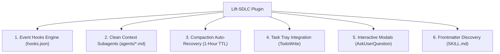

# Antigravity Native Features & Integration Report

This report documents all Google Antigravity-native mechanics, tools, hooks, and architectural features that the **Lift-SDLC** plugin heavily relies upon to execute autonomous, context-efficient, and resilient software development lifecycle workflows.

---

## 🧭 Executive Summary

Lift-SDLC is purpose-built for **Google Antigravity**. While it uses standard Node.js and Git utilities under the hood, its high-level safety, context isolation, state resilience, and user interaction loops are deeply coupled with Antigravity-specific runtime primitives.

---

## 🪝 1. Native Hooks Engine (`hooks.json`)

The plugin registers event hooks that Antigravity invokes at critical points in the agent lifecycle:

### A. PreToolUse Hooks
* **Files**: [`hooks/pre-tool-git-guard.js`](../hooks/pre-tool-git-guard.js), [`hooks/pre-tool-validate.js`](../hooks/pre-tool-validate.js).
* **Antigravity Mechanism**: Intercepts tool calls (`run_command`, `write_to_file`, `replace_file_content`) before execution.
* **Functionality**:
  - Automatically blocks destructive git commands (e.g., `git push --force` or checkout on `main`).
  - Halts unauthorized edits to protected files (e.g. modifying root `.sdlc/config.json` without appropriate permissions).

### B. PreInvocation Hooks
* **File**: [`hooks/session-start.js`](../hooks/session-start.js).
* **Antigravity Mechanism**: Invoked at the start of every session turn.
* **Functionality**:
  - Dynamically injects `<system-reminder>` context advisories into the model's system prompt.
  - Automatically detects interrupted pipelines and alerts the model to resume.

### C. Stop Hooks
* **File**: [`hooks/stop-state-save.js`](../hooks/stop-state-save.js).
* **Antigravity Mechanism**: Fires when an agent turn completes.
* **Functionality**:
  - Persists `.compact-recovery-<branchSlug>.json` snapshots to disk for compaction resilience.

---

## 🧠 2. Clean Context Subagent Architecture (`agents/*.md`)

Lift-SDLC utilizes Antigravity’s subagent dispatching mechanism to achieve pristine context isolation:

* **Zero Chat-Transcript Inheritance**:
  - Subagents declared in [`agents/`](../agents/) (`commit-orchestrator.md`, `review-orchestrator.md`, `plan-execution-validator.md`) run in isolated context windows.
  - They boot with **zero user chat history**, preventing multi-turn prompt bloat and reducing token consumption by up to 80%.
* **Disk Manifest Communication**:
  - Context is passed forward via serialized JSON manifests (`.sdlc/tmp/*-manifest.json`).
  - Results are returned via concise string tokens (`WAVE_SUMMARY`, `VERDICT_TOKEN`) or dedicated markdown artifacts (`review-comment.md`).
* **Native Model Suffix Routing**:
  - Explicitly targets Antigravity reasoning budget tiers in YAML frontmatter (`gemini-3.8-flash-low`, `gemini-3.8-flash-medium`, `gemini-3.8-flash-high`, `gemini-3.1-pro-high`).

---

## 🔄 3. Compaction Auto-Recovery (`/compact` & 1-Hour TTL)

Long-running pipelines (/plan $\rightarrow$ /execute $\rightarrow$ /review $\rightarrow$ /ship) naturally generate thousands of tokens. Antigravity provides native context compaction:

* **The Problem**: Compaction compresses prior chat turns, wiping in-memory step indices and variables.
* **The Antigravity Solution**:
  1. Antigravity's `Stop` hook writes `.compact-recovery-<branchSlug>.json`.
  2. When `/compact` is executed, the `SessionStart` / `PreInvocation` hook inspects the recovery file.
  3. If timestamp is within `COMPACT_RECOVERY_TTL_MS` (3,600,000 ms / 1 hour), it injects an `Active pipeline:` resume prompt.
  4. The pipeline seamlessly resumes from the exact incomplete wave or step without re-executing completed work.

---

## 📋 4. Live IDE Task Tray Visibility (`TodoWrite`)

* **Integration**: [`scripts/lib/ship-todos.js`](../scripts/lib/ship-todos.js) interfaces directly with Antigravity’s native **`TodoWrite` tool**.
* **Visual Experience**:
  - Renders live, interactive checklist progress in the Antigravity Code task tray sidebar.
  - Automatically transitions task items from `pending` $\rightarrow$ `in_progress` $\rightarrow$ `completed` as waves execute.

---

## 💬 5. Native Interactive Modal System (`AskUserQuestion`)

* **Integration**: Used in Step 4 of `/ship-sdlc` and during `/setup-sdlc` configuration wizards.
* **Visual Experience**:
  - Renders rich, interactive GUI selection modals directly in the Antigravity chat window.
  - Replaces fragile text parsing with structured choices (e.g. `[yes]`, `[edit]`, `[cancel]`), ensuring deterministic pipeline control.

---

## 🛠️ 6. Skill Discovery & Frontmatter Metadata

All 14 user-facing skills in [`skills/*/SKILL.md`](../skills/) leverage Antigravity’s native skill discovery specification:
* `user-invocable: true`: Registers the slash command (e.g. `/plan-sdlc`, `/ship-sdlc`).
* `argument-hint:`: Configures real-time CLI autocomplete in the Antigravity chat input box.
* `model:`: Enforces the baseline model tier per skill.

---

## 📊 Feature Dependency & Impact Matrix

| Antigravity Native Feature | SDLC Plugin Component | Impact If Run Outside Antigravity |
|---|---|---|
| **Event Hooks Engine** | `hooks.json`, `hooks/*` | ❌ Safety guardrails & state auto-save are disabled. |
| **Clean Context Subagents** | `agents/*.md`, `dispatchMode: "agent"` | ⚠️ Context bloat; tokens scale linearly with chat history. |
| **Compaction Recovery** | `stop-state-save.js` + `session-start.js` | ❌ Pipeline state lost after chat history compaction. |
| **Task Tray (`TodoWrite`)** | `ship-todos.js` | ⚠️ Loss of visual step progress in IDE sidebar. |
| **GUI Modals (`AskUserQuestion`)** | `ship.js`, `setup.js` | ⚠️ Degrades to raw text prompt loops. |
| **Frontmatter Skill Loader** | `skills/*/SKILL.md` | ❌ Slash commands & autocomplete unavailable. |
