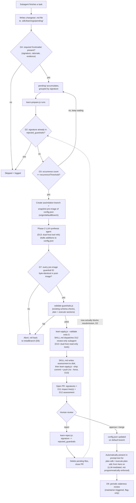

# ADR: Self-Learning Loop (`learn-sdlc`) — Final Architecture

**Status:** Accepted (Final) — ready for technical planning
**Date:** 2026-09-10
**Supersedes:** [`self-learning-proposal.md`](./self-learning-proposal.md) (v15), [`self-learning-decisions-appendix.md`](./self-learning-decisions-appendix.md)
**Incorporates:** [`self-learning-proposal-review.md`](./self-learning-proposal-review.md) (external-harness comparison, findings G1–G9)

This document is the single authoritative spec for `learn-sdlc`. It does not repeat the full reasoning behind each decision — that lives in the three documents above, all retained for historical record. What follows is the consolidated decision log plus a concrete, file-level implementation spec, written against the actual current state of this repo (verified by inspection this session, not assumed from the original proposal's pseudocode).

**Nothing described here exists as code yet.** `learn-prepare.js`, `learn-apply.js`, and `learn-reject.js` are all net-new. `scripts/lib/config.js`'s `PROJECT_SECTIONS` currently contains `version, jira, commit, pr, plan, execute` — no `rejected_guardrails` or `learn` section yet. `scripts/ci/validate-guardrails.js` already exists but only validates schema (id format, uniqueness, description, severity) — it has no notion of comparing two versions of a config against each other; that logic does not exist anywhere in this repo today and must be built new for D7.

---

## 1. Scope

**In scope (v1 build):** D1–D13 below — the full assimilation pipeline from pending file to merged guardrail, including the negative-cache fix, recurrence threshold, content-level regression protection, review-only pre-screen, and dual-host compliance.

**Explicitly deferred, not built in this pass:** D14 (skill-level promotion) and D15 (general definition-of-readiness gate) — both recorded as considered and intentionally out of scope, not overlooked.

---

## 2. Decision log

Each entry: **Decision** → **Why** → **Status**.

### D1 — Changeset-file storage
Learnings are independent, uniquely-slugged `.md` files in `.sdlc/learnings/pending/`, never a single shared log file or a database.
**Why:** avoids unresolvable 3-way merge conflicts across parallel branches; avoids cross-platform filesystem-lock issues a local DB would hit.
**Status:** carried forward unchanged from the original proposal (§1) / appendix (§1).

### D2 — Negative cache is enforced, not just written
`learn-prepare.js` MUST filter out any pending file whose signature already appears in `config.rejected_guardrails` before creating an assimilation branch. Matching is exact-string on the kebab-case signature for v1 — no fuzzy/semantic matching.
**Why:** fixes G1. The original design (proposal §3, appendix §2) only ever *writes* to `rejected_guardrails` via `learn-reject.js`; nothing reads it, so a rejected pattern can be resubmitted indefinitely.
**Status:** new, mandatory.

### D3 — Recurrence threshold before assimilation
A pattern becomes eligible for Prepare only once `N` or more pending files share (or clearly reference) the same signature. Default `N = 3`, configurable at `config.learn.recurrenceThreshold`. Files below the threshold stay in `pending/` and are re-evaluated on every `learn-prepare.js` run.
**Why:** fixes G2. Mirrors the external harness's own validated "3+ records" rule — without it, every single observation becomes a PR candidate.
**Status:** new.

### D4 — Structural pre-filter at Prepare time
Every pending file must carry, at minimum, `signature`, `rationale`, and `evidence` in its frontmatter. Malformed files are skipped and logged, not silently dropped, and never block the rest of the run.
**Why:** fixes G3 and is the concrete, narrow instance of the "definition of readiness" gap (G8/D15) this ADR actually builds — a minimum-viability check before spending synthesis effort, not the general unsolved version.
**Status:** new.

### D5 — Decoupled Prepare → Synthesis → Apply
A synchronous Node script cannot block on an LLM. Prepare creates the workspace and yields; an LLM agent performs synthesis; Apply validates and ships.
**Why:** carried forward unchanged (proposal §2, appendix §3).
**Status:** unchanged.

### D6 — Safe rollback to `initialBranch`
Before touching anything, capture the developer's current branch. On any failure in Apply, check out that branch before re-raising — never `reset --hard` against a shared ref.
**Why:** carried forward unchanged (proposal §2.2, appendix §4). Prevents catastrophic local data loss if a maintainer runs assimilation while on a feature branch.
**Status:** unchanged.

### D7 — Content-level, not just ID-level, regression protection
Before commit, Apply must diff the post-synthesis `plan`/`execute` guardrail arrays against a **pre-image** of `config.json` captured at Prepare time (`git show origin/<defaultBranch>:.sdlc/config.json`, snapshotted into the assimilation context to avoid a time-of-check/time-of-use gap). For every guardrail ID present in the pre-image, its full object (not just its `id`) must be byte-identical in the post-image. The only permitted diffs are: new guardrail objects appended, or a signature moved into `rejected_guardrails`.
**Why:** fixes G4. The original design's own pseudocode (proposal §2.2, step 1) left this as an explicit stub — `// (In real execution, preIds would be passed via context, checked here)` — and even the appendix's description (§5) only ever specifies an **ID-set containment** check, which proves survival of IDs, not content. An ID can survive while its rule text is silently gutted. Since this pipeline can modify `execute`-section (security) guardrails, that gap is a real weakening vector. This decision applies this repo's own established **strengthen-only** principle (already used in `harden-sdlc`) to `learn-apply.js` for the first time.
**Status:** new — supersedes appendix §5's containment-only check.

### D8 — Manual rejection via `learn-reject.js`
Unchanged mechanics from proposal §3 / appendix §6: parse the PR body for signatures, append to `rejected_guardrails`, delete matching pending files, commit, and `gh pr close` to release the concurrency lock.
**Why:** unchanged, but D2 is what makes this write meaningful for the first time — until D2 lands, this list is written but inert.
**Status:** unchanged mechanically; newly load-bearing per D2.

### D9 — Staleness review (flag-only)
A periodic, maintainer-triggered (never autonomous) step reports guardrails that appear unreferenced/untriggered for a configurable number of cycles, for a human to disposition. It only flags — it never deletes or downgrades a guardrail automatically.
**Why:** fixes G5. Without it, both `rejected_guardrails` and the active guardrail set can only grow as the codebase's assumptions change underneath them.
**Status:** new. See §5's open question — the underlying "was this guardrail ever triggered" signal does not appear to exist in this repo yet and needs its own investigation before this can be built.

### D10 — No `--force` on the assimilation push
`learn-apply.js` pushes to its own freshly-created, timestamp-unique branch without `--force`.
**Why:** fixes G6. `--force` was a silent no-op in the common case and a real (if unlikely) overwrite risk if a branch name were ever reused.
**Status:** new, minor.

### D11 — PR impact annotation
The PR body carries a short significance/revertability line per assimilated signature, sourced from an optional `impact` frontmatter field on the pending file. Absence of the field is not an error — it renders as "unscored" and does not block assimilation.
**Why:** fixes G7. `config.json` is shared, high-blast-radius state; a one-line triage hint costs little and helps the human reviewer prioritize.
**Status:** new, optional input, mandatory rendering.

### D12 — Review-only pre-screen subagent
After D7's mechanical validation passes and before PR creation, a subagent with **no write/edit tool access at all** reads the proposed diff plus the source pending files' rationale/evidence, and appends a short soundness/risk assessment to the PR body. It cannot block, approve, or modify anything — it only gives the human reviewer a head start.
**Why:** fixes G9. Every automated gate up to this point (D2–D4, D7, schema validation) is mechanical; none of them judge whether a proposed guardrail is actually well-reasoned or likely to false-positive. That judgment stays human, per the "no full autopilot" principle both this repo's own design and the external reference converge on — this just gives the human a pre-read, it does not delegate the decision.
**Status:** new.

### D13 — Dual-host (Claude Code + Antigravity) compliance
Every LLM-driven step this ADR introduces or touches — the Phase-2 synthesis step, D12's review-only subagent, any new `hooks.json` entries, any new `SKILL.md`/`agents/*.md` frontmatter — must work under both hosts, per [`plugin-api-specs.md`](./plugin-api-specs.md). Concretely: tool references in agent/skill instructions must cover both vocabularies (`Read`/`Write`/`Edit` vs. `view_file`/`write_to_file`/`replace_file_content`; `Read`/`Glob`/`Grep` vs. `view_file`/`find_by_name`/`grep_search` for D12's read-only set); subagent dispatch must account for `invoke_subagent`/`Subagents: [...]` vs. `Agent`/`subagent_type`; new frontmatter stays within the common `name`+`description` subset as load-bearing. `agy plugin validate <plugin-dir>` must be run against every new/changed skill, agent, or hook file this work produces.
**Why:** this repo already targets both hosts (`plugin-api-specs.md` exists precisely because of that), and none of D1–D12 as specified above account for it — v15 as originally written implicitly assumed Claude Code only.
**Status:** new, cross-cutting — applies to D5's synthesis step and D12 specifically, not to the pure-Node D2–D4/D7/D10 logic (which never calls a host tool and is unaffected by construction).

### Deferred / rejected (recorded, not built)

- **D14 — Skill-level promotion (deferred).** The external harness's "3+ memories → auto-created, immediately-usable skill" is not adopted as described — its own promotion step has no human gate, in tension with the "no full autopilot" conclusion the same source material reaches elsewhere. If ever built, it must be an optional Level-2 escalation reusing this same pipeline (Prepare → Synthesis → D7-style validation → PR → human merge), restricted to appending to an **existing** skill's resource file, and never creating a brand-new skill or making anything agent-invocable before a human merges it.
- **D15 — General "definition of readiness" gate (deferred).** Flagged as still industry-unsolved in the source material this proposal was compared against; only the narrow instance (D4) is built now.
- **Rejected outright:** vector-store semantic memory search (premature at the learning volume this design expects); per-subagent named personas and a fixed cost-tier model table (the Node/Agent split in D5 already isolates the one real LLM-cost surface — synthesis — more simply than a persona table would).

---

## 3. Consolidated lifecycle



*Note (F-guardrail-runtime-consumption-path-10): both consumers resolve guardrails from the main-worktree working tree, not `origin/<default>` — a merged guardrail is not actually present in a developer's prompts until their local main worktree pulls the commit that merged it. `plan.js` also passes `projectRoot` directly rather than `resolveSdlcRoot()`, so the two consumers are not guaranteed to resolve the same root; worth a one-line check if this ever causes a reported discrepancy, not fixed here.*

---

## 4. Implementation-ready specification

Grounded in the actual current repo layout (`scripts/lib/`, `scripts/ci/`, `scripts/skill/`, `scripts/util/`, all inspected this session).

### 4.1 `scripts/lib/config.js`
- Add `'rejected_guardrails'` and `'learn'` to `PROJECT_SECTIONS` (currently `new Set(['version', 'jira', 'commit', 'pr', 'plan', 'execute'])` at line 164).
- `config.learn` shape: `{ recurrenceThreshold: 3, staleAfterCycles: null }`.
- `config.rejected_guardrails` shape: `string[]` (signatures).

### 4.2 Git tracking of `.sdlc/learnings/pending/`
`.sdlc/learnings/` is already ignored today: `SDLC_GITIGNORE_PATTERNS` (`scripts/lib/config.js:408-414`) is a deny-all `*` plus an explicit allowlist, and `ensureSdlcGitignore()` idempotently rewrites `.sdlc/.gitignore` from that array on every run — a hand-edit to the file itself would be silently dropped. The un-ignore patterns (`!learnings/`, `!learnings/pending/`, `!learnings/pending/**`) must be appended to the `SDLC_GITIGNORE_PATTERNS` array (after the leading `'*'`, order-sensitive), not written to `.sdlc/.gitignore` directly.

*Known adjacent risk (out of scope here): `plan.js` builds a 4- or 5-lane critique array conditional on whether any plan guardrails are configured, while `skills/plan-sdlc/SKILL.md` still addresses lanes positionally (`lanes[i]`). The first guardrail this feature ever merges flips that topology — a pre-existing latent defect this feature exposes but does not cause. Tracked as a separate issue, not fixed here.*

### 4.3 New: `scripts/skill/learn-prepare.js` (+ `learn-prepare.test.js`, house convention — every `scripts/skill/*.js` file in this repo has a sibling `.test.js`)
1. Read all `.md` files in `.sdlc/learnings/pending/`.
2. Validate required frontmatter per D4; skip + log malformed files.
3. Extract signatures; drop any already in `config.rejected_guardrails` per D2.
4. Group remaining by signature; keep only groups meeting `config.learn.recurrenceThreshold` per D3.
5. If nothing qualifies, exit 0 (no-op) — same early-exit shape as v15's sketch.
6. Resolve default branch, create `sdlc/assimilation-<timestamp>` from `origin/<default>`.
7. Snapshot pre-image via `git show origin/<default>:.sdlc/config.json` for D7.
8. Write `assimilation-context.json`: `{ signatures, files, branchName, defaultBranch, preImage }`.

### 4.4 New: `scripts/skill/learn-apply.js` (+ test)
1. Load context (post Phase-2 synthesis, same handoff shape as v15).
2. Run existing `scripts/ci/validate-guardrails.js --section plan` and `--section execute` unchanged — it already covers id/kebab-case/uniqueness/description/severity schema checks and needs no modification for this ADR.
3. **New logic (D7):** compare every ID in `context.preImage`'s `plan.guardrails`/`execute.guardrails` against the post-synthesis `config.json`; any content mismatch or disappearance fails the step. Recommend extracting this as its own sibling validator, `scripts/ci/validate-guardrail-regression.js`, matching this directory's existing one-validator-per-concern convention (`validate-cost-tiers.js`, `validate-dimensions.js`, `validate-discovery.js`, etc. are all single-purpose) rather than inlining the diff logic directly in `learn-apply.js`.
4. `learn-apply.js` is two-phase, not one invocation (D5 sync/async split applies one level deeper than the original Prepare/Apply split): `--validate` runs steps 2–3 only and exits; on any failure it rolls back to `initialBranch` per D6.
5. On `--validate` success, `skills/learn-sdlc/SKILL.md` — not `learn-apply.js` itself — dispatches the D12 review-only subagent (dual-host tools per D13) and writes its returned assessment to disk.
6. `learn-apply.js --ship` then stages, commits, pushes without `--force` (D10), builds the PR body (signatures + D11 impact lines + D12 assessment), and opens the PR via `gh`.

### 4.5 New: `scripts/skill/learn-reject.js` (+ test)
Mechanically unchanged from proposal §3 — parse PR body, append to `rejected_guardrails`, delete matching pending files, commit, `gh pr close`.

### 4.6 New: `agents/learn-review-only.md`
Frontmatter tool whitelist restricted to read-only tools. Per D13, this repo's `agents/*.md` convention is already Antigravity-shaped today — every existing agent declares snake_case tools only (`tools: view_file` for the read-only trio) — so the frontmatter here follows that same shape. The "no edit access" guarantee is instead expressed in the instruction body via the canonical dual-host mapping table (`docs/plugin-api-specs.md` section 2), covering the Claude Code equivalent (`Read`) as well, since the mapping — not the frontmatter — is what must hold under both hosts.

### 4.7 `scripts/ci/` wiring for D13
Add (or extend an existing entrypoint with) an `agy plugin validate <plugin-dir>` check covering any skill/agent/hook file this work adds or changes. Exact wiring point (new standalone script vs. an existing CI entrypoint) is left open for `plan-sdlc` — this review's scope didn't extend to auditing this repo's CI trigger conventions.

### 4.8 `.sdlc/config.json` schema additions
```json
{
  "rejected_guardrails": ["signature-a", "signature-b"],
  "learn": {
    "recurrenceThreshold": 3,
    "staleAfterCycles": null
  }
}
```

---

## 5. Verification plan

- Sibling `*.test.js` for every new script, matching this repo's existing 1:1 convention in `scripts/skill/`, `scripts/ci/`, `scripts/util/`.
- `agy plugin validate` on every new/changed skill, agent, or hook file (D13).
- End-to-end positive scenario: 3 pending files sharing one signature → `learn-prepare.js` creates a branch → (mocked) synthesis appends exactly one new guardrail → D7's diff passes (no existing IDs touched) → PR opens carrying an impact line and a review-only assessment → merge → `rejected_guardrails` unaffected.
- End-to-end negative scenario: synthesis mutates an existing guardrail's `description` while keeping its `id` → D7 must fail and roll back to `initialBranch`, never reaching commit.
- Rejection-loop scenario: reject a PR → resubmit the same signature via a new subagent run → D2 must silently drop it at Prepare time, never reaching PR again.

## 6. Open questions for `plan-sdlc`

- **Recurrence matching (D2/D3):** exact-signature-string matching only for v1. Fuzzy/semantic matching across near-duplicate signatures is out of scope here and should stay that way unless a concrete need surfaces.
- **Staleness signal (D9):** what actually proves a guardrail was "referenced/triggered" in a cycle does not appear to exist in this repo yet (no usage-telemetry mechanism was found during this review) — needs its own short investigation before D9 can be implemented, not just documented.
- **CI trigger point (D13/4.7):** where exactly `agy plugin validate` gets wired in is left to planning, since it depends on this repo's CI conventions, which were out of scope for this review.
