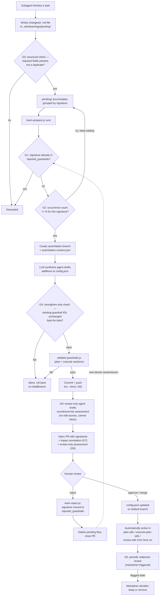
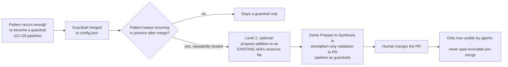

# Review: self-learning-proposal.md (v15) vs. an external self-learning harness

> **Status: Superseded.** Retained for historical record only. Every finding here (G1–G9) has been
> folded into [`self-learning-adr.md`](./self-learning-adr.md)'s decision log (D1–D13) — see that
> document for the current, implementation-ready design.

This is an addendum to [`self-learning-proposal.md`](./self-learning-proposal.md) and its [decisions appendix](./self-learning-decisions-appendix.md), not a replacement. It evaluates v15's `learn-sdlc` design against an external reference point: a real, production-used Copilot-based team-lead/subagent harness (built by a practitioner outside Godel, demonstrated live, tested down to a junior-developer-with-no-context scenario) that has its own self-learning loop plus a governance layer around it. Where that harness's validated design decisions expose gaps in v15, they're listed below as findings; where v15 is already ahead, that's noted too, for balance.

**Status:** v15 is still a proposal — nothing described here or in the base document exists as code yet. These are recommendations to fold in before implementation, not bug reports against running code.

---

## Summary verdict

v15 is a solid, narrowly-scoped *mechanical* design: changeset storage, branch/PR mechanics, and rollback safety are all well thought through (see "Where v15 is already ahead" below). What it under-specifies is the *governance* layer around assimilation — recurrence thresholds, negative-cache enforcement, content-level regression protection, and staleness pruning — all of which the external harness had to solve in production and which v15's current design either omits or only partially implements.

---

## Cross-cutting requirement: must comply with the Antigravity CLI/IDE plugin API

This repo already targets two hosts, not one — [`docs/plugin-api-specs.md`](./plugin-api-specs.md) documents the confirmed compatibility surface and divergences between Claude Code and Google's Antigravity CLI/IDE, compiled from direct inspection plus Antigravity's official schemas. Anything added under this proposal (v15 as written, plus every fix G1–G9 above) must be built to that same dual-host contract, not just the Claude Code shape v15 currently assumes implicitly.

**Not affected — host-agnostic by construction:** `learn-prepare.js` and `learn-apply.js` only ever call `git`/`gh`/`node` via `execFileSync`. They never call a Claude Code or Antigravity *tool* directly, so they run identically under either host with no changes needed.

**Affected — anything that is itself an LLM-driven skill/agent step:**

- **The Phase 2 synthesis agent** (§2.2 of the base proposal — "the LLM Agent modifies configurations via its standard tools") is exactly the kind of step `plugin-api-specs.md` §3 warns about: its instructions must reference the correct native tool set per host (`Read`/`Write`/`Edit` under Claude Code vs. `view_file`/`write_to_file`/`replace_file_content` under Antigravity), not one hard-coded set.
- **G9's review-only subagent** needs a read-only tool whitelist. This repo's `agents/*.md` are already Antigravity-shaped (`tools: view_file`), so the frontmatter itself stays single-vocabulary; the "no edit access" guarantee is what must be expressed for both hosts, via the instruction body's dual-host mapping (`Read` vs. `view_file`/`find_by_name`/`grep_search`), not via a second frontmatter block.
- **Any subagent dispatch** for synthesis or review-only work must account for the `invoke_subagent`/`Subagents: [...]` schema under Antigravity differing from Claude Code's `Agent`/`subagent_type` (see `plugin-api-specs.md` §2, item 3).
- **Any new `hooks.json` entries** this proposal introduces (e.g. a trigger for `learn-prepare.js`) must use the shared event-keyed shape both hosts support, per `plugin-api-specs.md` §1/§2.
- **Any new/changed `SKILL.md` or `agents/*.md` frontmatter** introduced for this work should stay within the common subset (`name`, `description`) as load-bearing, treating Claude-Code-only fields (`user-invocable`, `argument-hint`, etc.) as additive only — per the recommendation already given in `plugin-api-specs.md` §3.

**Verification:** run `agy plugin validate <plugin-dir>` against any new/changed skill, agent, or hook files this proposal produces, the same way `plugin-api-specs.md` §3 already recommends for `lift-fix-price` — this repo's own `scripts/ci/*.js` validators are the natural place to wire that check in permanently rather than relying on a one-off manual run.

---

## Gaps found

Ranked by severity. Each entry: issue → why it matters → recommended fix.

### G1 (bug, high severity): the negative cache is write-only

`rejected_guardrails` is appended to by `learn-reject.js` (`self-learning-proposal.md` §3, step 3) but is never read anywhere else in the design — not by `learn-prepare.js`'s file selection, not by `learn-apply.js`'s validation gate. This defeats the stated purpose of [ADR §2](./self-learning-decisions-appendix.md#2-negative-cache-semantic-signatures) ("preventing infinite re-suggestion"): a pattern a maintainer already rejected can be re-proposed by another subagent indefinitely, since nothing ever checks the new pending signature against the rejected list.

**Fix:** `learn-prepare.js` must filter out any pending file whose signature (or a fuzzy/semantic match against one) already appears in `rejected_guardrails` *before* creating the assimilation branch — dropping it silently (or logging it) rather than letting it reach synthesis.

### G2 (design gap): no recurrence threshold before assimilation

Every single pending file becomes a PR candidate on its own, as soon as `learn-prepare.js` finds it. The external harness's analogous loop deliberately waits for **3+ independent records** to concern the same recurring pattern before promoting it into a reusable skill — an explicit anti-noise measure, not an incidental detail.

**Fix:** require a minimum occurrence count (the same or a related signature observed N times across pending files) before a pattern is eligible for Prepare. This cuts PR churn from one-off or weak-signal observations that may just be noise from a single run.

### G3 (design gap): no pre-filter before landing in `pending/`

Any subagent can write any `.md` file into `.sdlc/learnings/pending/` with no dedup or sanity check at write time. The external harness has its lead role explicitly filter subagent-proposed lessons *before* they even count as memory — stated as a defense specifically against weaker subagent models cluttering memory with noise.

**Fix:** add a lightweight structural check, either at write time or at Prepare time: required frontmatter fields present, and dedup against both existing guardrails and `rejected_guardrails` (this overlaps with G1's check and can share the same lookup).

### G4 (security-relevant, high severity): the regression check proves ID survival, not content survival

[ADR §5](./self-learning-decisions-appendix.md#5-security-fail-open-regression-checks)'s "Per-Section Set Containment" check only proves that `postIds ⊇ preIds`. It says nothing about whether an existing guardrail's *text* changed. A synthesis agent could keep an existing guardrail's `id` while silently rewriting its rule into a no-op, and the containment check would still pass. Because this pipeline can modify **execute-section (security) guardrails**, that's a real weakening vector, not just a quality concern — closer to the kind of thing the project's own `harden-sdlc` skill is careful never to permit.

**Fix:** adopt the same **strengthen-only** principle already established in this repo (`skills/harden-sdlc/SKILL.md`) explicitly for `learn-apply.js`: the synthesis step may only *append* new guardrails or move a signature into `rejected_guardrails` — it must never alter the text of an existing guardrail ID. Enforce this as a content-diff check (existing IDs' text must be byte-identical pre/post), not merely an ID-set check.

### G5 (missing capability): no staleness/pruning mechanism

The external harness explicitly prunes memories that go stale — its own concrete example is dropping EF-related lessons once the team migrates to Dapper. v15 has no equivalent: both `rejected_guardrails` and the active guardrail set can only grow as the codebase evolves past the assumptions a guardrail was written under.

**Fix:** a periodic, maintainer-triggered (not autonomous) review step that flags guardrails unreferenced/untriggered for N cycles for disposition. Flag-only, never auto-delete — consistent with the strengthen-only stance in G4.

### G6 (minor correctness): unnecessary `--force` push

`learn-apply.js` pushes with `git push origin HEAD:branchName --force` (§2.2, step 4) to a branch it just created from `origin/<defaultBranch>` with a timestamp-unique name. In the normal case `--force` is a no-op; if the branch name were ever reused (e.g., a retry within the same millisecond-resolution collision, or a manual re-run), it would silently overwrite instead of surfacing a conflict.

**Fix:** drop `--force`.

### G7 (nice-to-have): no blast-radius/significance annotation

The external harness's "AD file" scores every delegated change on significance, revertability, and how many team members it affects, logged *before* the change is even made. Assimilation here touches shared `config.json` — high blast radius, and hard to revert cleanly once other automation or agents start relying on a newly-added guardrail.

**Fix:** have the PR body (or the pending-file frontmatter) carry a lightweight impact field — even a single significance/revertability tag — so the human reviewer can triage faster.

### G8 (context only, not actionable yet): a narrow echo of the "definition of ready" gap

`learn-prepare.js` doesn't validate that a pending file is well-formed or sufficiently justified (signature present, rationale, supporting evidence) before spending synthesis effort on it. This is a small instance of a gap the source material documents as still industry-unsolved in general (no upfront check that a task is sufficiently specified before an agent starts on it) — worth a forward-reference here, but not worth over-building given even the practitioner harness this is compared against hasn't solved the general version.

### G9 (nice-to-have, process improvement): no automated pre-screen of *content quality* before human review

Every automated gate in this pipeline (G1–G4, plus `validate-guardrails.js`) is mechanical: it catches duplicates, previously-rejected patterns, structural malformation, and tampering with existing guardrail text. None of them evaluate whether a proposed guardrail is actually well-reasoned, correctly scoped, or likely to produce false positives — that judgment currently falls entirely on the human PR reviewer, with no automated first pass. The external harness has a dedicated **review-only subagent** for exactly this kind of gap: structurally barred from editing anything (no edit tool access at all, not just a prompt instruction), able only to approve or reject.

**Fix:** insert an optional review-only agent step between `learn-apply.js`'s mechanical validation and PR creation. It reads the proposed guardrail addition alongside the evidence in the source pending files and appends a short written assessment to the PR body (soundness, scope, likely false-positive risk). It has no tool access to modify the branch, config, or PR — it cannot block or approve anything itself. This gives the human reviewer a head start without weakening the human gate as the final authority, consistent with the "no full autopilot" conclusion in the source material.

---

## Mechanism walkthrough: how a learning becomes an active guardrail

The fixes above (G1–G7) aren't independent patches — they compose into one lifecycle. This is what "applying" a learning actually looks like end to end, once those fixes are in place. Note that there is no separate "activation" step: once a guardrail lands in `config.json` on the default branch, every SDLC skill that reads that file (`plan-sdlc`, `execute-plan-sdlc`, `review-sdlc`, …) picks it up automatically on its next run.

Key point highlighted by the diagram: the **only** two places where anything is written automatically without a human in the loop are the pending-file write (step 1, cheap and reversible — it's just a file) and the PR creation (step 8, still requires merge to take effect). Everything that actually changes shared, trusted state (`config.json` on the default branch) passes through a human gate — consistent with the "no full autopilot" conclusion in the source material this proposal is being compared against.

---

## A related idea from the source material, not adopted as-is: dynamic skill promotion

The external harness distinguishes two levels of learned knowledge: raw **memories/lessons**, and **skills** — once 3+ records concern the same recurring pattern, a separate analysis subagent automatically promotes it into a reusable skill, assigns it to a subagent, and that subagent can use it directly in later task execution.

This targets a different layer than v15 (or the G1–G9 fixes above). v15 turns a recurring learning into a **guardrail**: a declarative constraint, read passively at plan/execute/review time. A "skill" in the external harness is a **procedural capability** an agent invokes and executes directly during a task.

**Why not adopt this directly:**

- **Blast radius is a different order of magnitude.** A flawed guardrail produces a wrong warning, caught by the next reader. A flawed auto-generated skill produces a wrong *action*, executed directly by an agent mid-task.
- **Skills in this repo are curated artifacts, not free text.** `SKILL.md` files carry specific frontmatter, triggers, and resources, and are listed by name to every future session (as this very conversation's own available-skills list demonstrates). Auto-creating them risks trigger collisions, duplication, and a cluttered, inconsistent skill catalog — a much larger version of the noise problem G3 already targets for guardrails.
- **As described, the external harness's own promotion step has no human gate** — a skill becomes usable immediately once the analysis subagent promotes it. That is in direct tension with the "no full autopilot" conclusion the same source material reaches elsewhere (see the base review's summary of that note) — this one mechanism, taken literally, is the exception to a rule its own author otherwise insists on.

**How it could be adapted instead** — as an optional escalation on top of the guardrail pipeline already proposed above, not a separate autonomous mechanism:

The distinction that matters: no brand-new skill is ever created from scratch automatically, and nothing becomes agent-invocable before a human merges it. Promotion to skill-level is an extension of the same human-gated guardrail pipeline, never a parallel autonomous one.

---

## Where v15 is already ahead

Not everything here is a gap — a few of v15's decisions are stronger than anything in the external reference:

- **Decoupled Node/Agent Prepare→Apply split** ([ADR §3](./self-learning-decisions-appendix.md#3-workflow-trigger-the-agentic-two-phase-split)) solves a real synchronous/asynchronous execution problem that the external harness's chat-based orchestration never had to face.
- **Explicit `initialBranch` rollback-on-failure** ([ADR §4](./self-learning-decisions-appendix.md#4-local-data-protection-safe-git-rollbacks)) guards against a catastrophic local-data-loss class that the external harness's own description doesn't mention protecting against at all.
- **Per-file changeset storage** ([ADR §1](./self-learning-decisions-appendix.md#1-storage-layer-the-changeset-paradigm)) is a cleaner, merge-conflict-free answer than the external harness's flatter, less-specified "memories" concept.

## Explicitly not recommended

- **Per-subagent named personas / a fixed cost-tier model table** — v15's Node/Agent split already isolates the only real LLM-cost surface (the synthesis step) more simply; there's no equivalent of the external harness's many named, always-on subagents to pin models against.
- **Vector-store semantic memory search** — premature at the learning volume this design is expected to see; a flat pending-file list with signature-based dedup (G1/G3) is enough until that stops being true.
