# /ship-sdlc Execution Pipeline & Review Loops Analysis

This document provides a comprehensive analysis of the execution pipeline, planning/execution review loops, scatter-gather code reviews, conditional fix workflows, hardening mechanisms, model mapping reviews, model generation upgrades (v3.5 → v3.7), and token optimization proposals for `/ship-sdlc` in Lift-SDLC.

---

## 📋 Phase 1: Pre-flight & Setup Checks

### 1. Step 0 — Plan Mode Check
- Checks whether the system context contains the string "Plan mode is active" (inline check in `SKILL.md`, no wrapper script).
- If planning mode is active, saves pipeline state to `.sdlc/execution/ship-*.json` and halts execution (since shipping requires git commits & PR writes).

### 2. Step 1 — Load Config, Parse Flags & Detect Context
- Loads `.sdlc/local.json` and `.sdlc/config.json` configuration hierarchy.
- Executes [`ship.js`](../scripts/skill/ship.js) (`skill/ship.js`) to detect active branch, uncommitted changes, open PRs, and OpenSpec state.
- Resolves Quality Tier preset (`minimal`, `balanced`, `full`).

### 3. Step 2 & 3 — Build Execution Plan & Validation Critique
- Constructs the sub-skills execution table (`execute-plan-sdlc`, `commit-sdlc`, `review-sdlc`, `version-sdlc`, `pr-sdlc`).
- Validates `gh` CLI authentication, branch state, and flag coherence.

### 4. Step 4 — Confirmation Gate
- Displays execution table. (Skips prompt in `--auto` mode; outputs dry-run table in `--dry-run` mode).

---

## ⚡ Phase 2: Sequential Execution Steps & Review Loops

```mermaid
flowchart TD
    Start["/ship-sdlc Invoked"] --> PlanCheck["Step 0: Plan Mode Check"]
    PlanCheck --> Init["Step 1: Load Config & Parse Flags"]
    Init --> Table["Step 2-4: Validate & Present Execution Plan"]
    
    Table --> ExecStep["Step 5.1: Execute Plan (/execute-plan-sdlc)"]
    
    subgraph PlanReviews ["Planning & Execution Reviews"]
        PlanVal["Plan Execution Validator (sdlc:plan-execution-validator)"]
        WaveRunner["Wave Runner Subagent"]
        TaskAgent["Per-Task Coding Agent (Escalation Ladder)"]
        SpecRev["Spec Compliance Reviewer"]
    end
    
    ExecStep --> PlanVal --> WaveRunner --> TaskAgent --> SpecRev
    SpecRev --> CommitStep["Step 5.2: Smart Commit (/commit-sdlc)"]
    
    CommitStep --> CommitOrch["sdlc:commit-orchestrator (Flash 3.7 Low)"]
    CommitOrch --> ReviewStep["Step 5.3: Scatter Review (/review-sdlc)"]
    
    subgraph ReviewLoop ["Scatter-Gather Code Reviews"]
        Scatter["Scatter: Parallel Dimension Subagents"]
        Gather["Gather: Review Orchestrator (sdlc:review-orchestrator)"]
        Verdict["Verdict Calculation (APPROVED / CHANGES REQUESTED)"]
    end
    
    ReviewStep --> Scatter --> Gather --> Verdict
    Verdict --> ThresholdCheck{"Review Threshold Met?"}
    
    ThresholdCheck -- "Yes (Crit/High)" --> FixStep["Step 5.4: Fix Loop (/received-review-sdlc)"]
    FixStep --> FixCommit["Step 5.4b: Fix Commit (/commit-sdlc --auto)"]
    FixCommit --> VersionStep
    ThresholdCheck -- "No (Approved)" --> VersionStep["Step 5.5: Versioning (/version-sdlc)"]
    
    VersionStep --> PRStep["Step 5.6: Pull Request (/pr-sdlc)"]
    PRStep --> CIStep["Step 5.7: CI Verification (/verify-pipeline-sdlc)"]
    CIStep --> HardenStep["Step 5.7b: Failure Hardening (/harden-sdlc)"]
    HardenStep --> Finish["Step 6: Release & Summary Completed"]
```

---

### Step 5.1: Plan Execution & Wave Review (`/execute-plan-sdlc`)
* 🔍 **Plan Review 1 (Plan Execution Validator)**:
  - Dispatches [`plan-execution-validator`](../agents/plan-execution-validator.md) (`gemini-3.1-pro-low`) in clean context to validate plan integrity, circular dependencies, file collision risks, and wave structure.
* ⚡ **Parallel Wave Runner**:
  - Dispatches `wave-runner` (`gemini-3.8-flash-low`) to execute tasks wave-by-wave.
  - Fans out `per-task coding agent` subagents in parallel to write files and run local unit tests.
  - **Model Escalation Ladder**: If a task fails verification, `wave-runner` retries up to 2 times, escalating model engine tier: `gemini-3.8-flash-low` $\rightarrow$ `gemini-3.8-flash-medium` $\rightarrow$ `gemini-3.8-flash-high` $\rightarrow$ `gemini-3.1-pro-low`.
* 🔍 **Plan Review 2 (Spec Compliance Reviewer)**:
  - At the end of each wave, runs `spec-compliance-reviewer` to verify that all task deliverables strictly conform to `implementation_plan.md` requirements before marking the wave completed.

---

### Step 5.2: Conventional Smart Commit (`/commit-sdlc`)
* Serializes staged git diff to `.sdlc/tmp/commit-manifest.json`.
* Dispatches [`commit-orchestrator`](../agents/commit-orchestrator.md) (`gemini-3.8-flash-low`) in clean context.
* Analyzes recent commit history style and `.sdlc/config.json` regex rules (`allowedTypes`, `allowedScopes`, `subjectPattern`).
* Returns a single conventional commit message string (e.g. `feat(auth): implement OAuth2 token rotation (#42)`) and executes git commit.

---

### Step 5.3: Scatter-Gather Code Review (`/review-sdlc`)
* Serializes diff payload to `.sdlc/tmp/review-manifest.json`.
* Dispatches [`review-orchestrator`](../agents/review-orchestrator.md) (`gemini-3.8-flash-low`) in clean context.
* 🔍 **Code Review 1 — Scatter Phase (Parallel Dimension Reviewers)**:
  - Fans out targeted subagents in parallel across configured dimensions (`security-review`, `performance`, `docs`, `architecture`, `testing`). Each subagent reviews diff hunks for its specific lens.
* 🔍 **Code Review 2 — Gather & Critique Phase**:
  - `review-orchestrator` gathers raw findings from all dimension subagents.
  - Runs deduplication, severity recalibration, and false-positive filtering.
  - Computes deterministic verdict (`APPROVED`, `APPROVED WITH NOTES`, `CHANGES REQUESTED`).
  - Writes consolidated `review-comment.md` artifact to disk.

---

### Step 5.4: Conditional Received Review & Fix Loop (`/received-review-sdlc`)
* Checks findings against `flags.reviewThreshold` (`critical`, `high`, `medium`, `low`).
* **If threshold met** (e.g. `critical` or `high` findings present):
  1. Dispatches [`received-review-sdlc`](../skills/received-review-sdlc/SKILL.md) (`gemini-3.8-flash-high`) to process review feedback.
  2. Implements required code fixes for "will fix" items.
  3. Re-runs unit tests to verify fixes.
  4. 📝 **Fix Commit**: Dispatches `/commit-sdlc --auto` to create a dedicated fix commit (`fix(review): apply code review feedback`).

---

### Step 5.5: Semantic Versioning & Release Tagging (`/version-sdlc`) *(Optional)*
* Analyzes commit messages since last tag.
* Calculates version bump (`patch`, `minor`, `major`, or pre-release label `--bump rc`).
* Updates `CHANGELOG.md` and creates git release tag.

---

### Step 5.6: Pull Request Generation (`/pr-sdlc`)
* Generates detailed PR title and description linking context and commit history.
* Opens Pull Request via `gh pr create` (or `--draft`).

---

### Step 5.7: Optional CI Verification & Hardening (`/verify-pipeline-sdlc` & `/harden-sdlc`)
* 🧪 **CI Pipeline Verification**: Interfaces with GitHub Actions to monitor PR build status.
* 🛡️ **Hardening Review (On CI Failure)**:
  - If CI fails, dispatches [`harden-orchestrator`](../agents/harden-orchestrator.md) (`gemini-3.8-flash-low`).
  - Classifies root cause (`user-code` vs `plugin-defect`).
  - Emits `harden-proposal.json` to strengthen pre-tool guardrails and prevent future regressions.

---

### Step 5.8: Learnings & State Finalization
* Commits updated `.sdlc/` state snapshots and telemetry logs.

---

## 📊 Phase 3: Final Pipeline Summary

Outputs final summary containing:
- Execution status per step
- Final commit hash & tag
- Review verdict & findings count
- PR URL link

---

## 🚀 Gemini Flash Model Generation Upgrade (v3.5 → v3.7)

All Gemini Flash references across the plugin are upgraded to the latest **Gemini 3.7 Flash** series, providing improved token throughput, faster latency, and superior instruction-following:

| Component Category | Legacy Model Target (v3.5) | Upgraded Latest Model (v3.7) |
|---|---|---|
| **Low-Reasoning Orchestrators** | `gemini-3.8-flash-low` | `gemini-3.8-flash-low` |
| **Standard Skills & Coordinators** | `gemini-3.8-flash-medium` | `gemini-3.8-flash-medium` |
| **High-Context Skills & Fix Loops** | `gemini-3.8-flash-high` | `gemini-3.8-flash-high` |
| **Dispatch Budget Ceiling** | `gemini-3.8-flash` | `gemini-3.8-flash` |

---

## 🧠 Upgraded Models Mapping Inventory

Lift-SDLC segments work across the latest **`gemini-3.8-flash`** (`-low`, `-medium`, `-high`) and `gemini-3.1-pro` (`-low`, `-high`).

### Model Mapping Inventory

| Component | Entity Type | Target Model | Role & Rationale |
|---|---|---|---|
| `commit-orchestrator` | Orchestrator Agent | `gemini-3.8-flash-low` | Bounded conventional commit drafting |
| `error-report-orchestrator` | Orchestrator Agent | `gemini-3.8-flash-low` | Crash report template formatting |
| `harden-orchestrator` | Orchestrator Agent | `gemini-3.8-flash-low` | Bug cause classification & proposal emission |
| `plan-explore-orchestrator` | Orchestrator Agent | `gemini-3.8-flash-low` | Planning axes derivation & subagent coordinator |
| `review-orchestrator` | Orchestrator Agent | `gemini-3.8-flash-low` | Scatter-gather review consolidation |
| `plan-execution-validator` | Orchestrator Agent | `gemini-3.1-pro-low` | Static analysis of plan circularity & collision risks |
| `plan-generation-orchestrator` | Orchestrator Agent | `gemini-3.1-pro-high` | Multi-wave architecture plan drafting |
| `/setup-sdlc`, `/plan-sdlc`, `/execute-plan-sdlc` | User Skills | `gemini-3.8-flash-medium` | Interactive coordinators |
| `/pr-sdlc`, `/received-review-sdlc`, `/verify-pipeline-sdlc`, `/harden-sdlc` | User Skills | `gemini-3.8-flash-high` | High cognitive context skills |

---

## 💡 Token & Model Optimization Proposals

The following 9 technical optimization proposals outline how to significantly decrease token consumption across `/ship-sdlc` without compromising code quality or security safety:

### Summary of Optimization Proposals

| Strategy | Target Workflow | Mechanism | Estimated Savings | Impact / Trade-off |
|---|---|---|---|---|
| **1. Dynamic Dimension Pruning** | `/review-sdlc` | Matches changed file paths against dimension rules before scattering subagents. Skips irrelevant review lanes (e.g. skip `security-review` if only CSS/docs changed). | **40% – 60%** (Review) | 🟢 Zero quality loss (eliminates wasteful subagents) |
| **2. Diff-Hunk Budgeting & Truncation** | `/commit-sdlc`, `/review-sdlc` | Shifts from flat 8KB cap in `diff-truncate.js` to intelligent filtering (e.g. `git diff -U1` fallbacks and lockfile exclusions via `--stat`). | **30% – 50%** (Manifests) | 🟢 Preserves functionality while avoiding truncation loss |
| **3. Task Fact Sheet Trimming** | `/execute-plan-sdlc` | Injects **only** the target task line and immediate file targets into per-task subagents, rather than passing the complete multi-wave `implementation_plan.md`. | **35% – 50%** (Execution) | 🟢 Cleaner context per task, faster completion |
| **4. Low-Complexity Fast-Path** | All skills | Automatically routes single-file edits ($<15$ lines), documentation updates, or mechanical refactors to `gemini-3.8-flash-low` with capped output tokens (`max_tokens: 400`). | **25% – 45%** (Routing) | 🟢 Significant speed & cost improvement |
| **5. Commit History Pruning** | `/commit-sdlc` | Reduces recent git style detection history from 15 commits to 5 oneline commits in `.sdlc/tmp/commit-manifest.json`. | **10% – 15%** (Commit) | 🟢 Zero impact on message quality |
| **6. Review Dimension Model Tier Tuning** | `/review-sdlc` | Assigns `gemini-3.8-flash-low` to lightweight dimensions (`docs`, `syntax`, `comments`) instead of global `flash-medium`. | **15% – 25%** (Review) | 🟢 Faster review response times |
| **8. PR Description Diff Budgeting** | `/pr-sdlc` | Applies `diff-truncate.js` (-U1 fallbacks, lockfile exclusions) to `pr.js` to filter massive PR diffs before description generation. | **30% – 50%** (PR Gen) | 🟢 Prevents PR description hallucinations on huge diffs |
| **9. Dynamic Lane Pruning** | `/plan-sdlc` | Prunes `guardrail-compliance` and `dimension-coverage` lanes dynamically in `plan.js` if those features are empty in the project. | **40%** (Critique) | 🟢 Eliminates 2 wasted subagent dispatches per plan |
| **7. Outer Coordinator Skill Downgrade** | `/commit-sdlc`, `/version-sdlc` | Downgrades routine wrapper skills from `flash-medium` to `flash-low` (`gemini-3.8-flash-low`) since heavy logic is already handled by scripts & orchestrators. | **10% – 20%** (Wrappers) | 🟢 Lowers coordinator turn overhead |

---

### Deep Technical Breakdown of Proposals

#### Proposal 1: Dynamic Dimension Pruning (`/review-sdlc`)
- **Current Bottleneck**: Currently, `/review-sdlc` fans out subagents for all 5 active review dimensions (`security-review`, `performance`, `docs`, `architecture`, `testing`) regardless of which files were modified in the commit.
- **Optimization Design**: Update [`scripts/lib/dimensions.js`](../scripts/lib/dimensions.js) to match changed file extensions and path patterns before spawning subagents:
  - If changed files do **not** touch security paths (`auth/`, `crypto/`, `keys/`, `env`) $\rightarrow$ skip `security-review` subagent.
  - If changed files touch **only** markdown or docstrings $\rightarrow$ run **only** `docs` dimension subagent.
  - If changed files touch **only** unit test files (`*.test.js`, `*.spec.ts`) $\rightarrow$ skip `performance` and `architecture`.

#### Proposal 2: Diff-Hunk Budgeting & Truncation (`scripts/lib/diff-truncate.js`)
- **Current Bottleneck**: `scripts/skill/commit.js` already truncates diffs to an 8,000 character hard limit via `truncateStagedDiff`. Raising the ceiling to 30KB without structural filtering causes wasteful token consumption on massive auto-generated files (e.g. `package-lock.json`).
- **Optimization Design**:
  - Shift strategy from a flat character limit to intelligent hunk filtering.
  - Implement a `git diff -U1` fallback for diffs exceeding the 8KB limit to preserve functional context while trimming unchanged surrounding lines.
  - Exclude known massive lockfiles (`package-lock.json`, `pnpm-lock.yaml`) automatically, replacing them with `--stat` summaries.

#### Proposal 3: Task Fact Sheet Trimming (`/execute-plan-sdlc`)
- **Current Bottleneck**: `wave-runner` passes the complete `implementation_plan.md` (which can span hundreds of lines) into every `per-task coding agent` subagent prompt.
- **Optimization Design**:
  - Create a helper module `scripts/lib/task-trimmer.js` that extracts **only** Task $N$'s specific task title, target file paths, and acceptance criteria from `implementation_plan.md`, stripping away all unrelated wave documentation before subagent dispatch.

#### Proposal 4: Low-Complexity Fast-Path (Automatic Model Tier Routing)
- **Current Bottleneck**: Trivial tasks (e.g. single-line version bumps or typo fixes) use standard model routing (`flash-medium` or `pro-low`), consuming excessive reasoning budgets.
- **Optimization Design**:
  - Add an automatic complexity classifier in `skill/ship.js`: if modified files $= 1$ and diff lines $< 15$, automatically route to `gemini-3.8-flash-low` with a capped response length (`max_tokens: 400`).

#### Proposal 5: Commit Style History Pruning (`/commit-sdlc`)
- **Current Bottleneck**: `commit-prepare.js` includes the last 15 commit messages in `.sdlc/tmp/commit-manifest.json` for style inference.
- **Optimization Design**:
  - Cap recent commit history to 5 oneline commits, saving $\approx 500-1000$ tokens per commit generation call while preserving style detection accuracy.

#### Proposal 6: Review Dimension Model Tier Tuning
- **Current Bottleneck**: All review subagents inherit `review.subagent_model` default (`flash-medium`), even for simple syntax or documentation dimensions.
- **Optimization Design**: Configure per-dimension model overrides in `.sdlc/config.json` (`docs` and `style` dimensions set to `gemini-3.8-flash-low`, reserving `flash-medium`/`pro-low` for `security-review`).

#### Proposal 8: PR Description Diff Budgeting (`/pr-sdlc`)
- **Current Bottleneck**: Just like `/commit-sdlc`, `scripts/skill/pr.js` injects the raw, unfiltered unified diff (`git diff HEAD...base`) entirely into `PR_CONTEXT_JSON`.
- **Optimization Design**: Apply the exact same intelligent Diff-Hunk Filtering (Proposal 2) to `pr.js`. Utilizing `scripts/lib/diff-truncate.js` (with `-U1` context reduction and `--stat` lockfile exclusions) will radically decrease the payload sent to the orchestrator.

#### Proposal 9: Dynamic Lane Pruning for Plan Critique (`/plan-sdlc`)
- **Current Bottleneck**: Step 3 of `/plan-sdlc` unconditionally fans out 5 parallel critique subagents (lanes) for every plan generated, including dedicated subagents for `guardrail-compliance` and `dimension-coverage`.
- **Optimization Design**: Dynamically prune these lanes in `scripts/skill/plan.js`. If a project has zero execution guardrails configured, entirely skip spawning the `guardrail-compliance` subagent. If there are no custom review dimensions, skip the `dimension-coverage` subagent.

#### Proposal 7: Outer Coordinator Skill Downgrade
- **Current Bottleneck**: Wrapper skills like `/commit-sdlc` and `/version-sdlc` specify `gemini-3.8-flash-medium` in frontmatter despite only running CLI scripts and orchestrator dispatches.
- **Optimization Design**: Update frontmatter in `skills/commit-sdlc/SKILL.md` and `skills/version-sdlc/SKILL.md` to `gemini-3.8-flash-low`.

---

## 📊 Architectural Review & Feasibility Scorecard

| Proposal | Feasibility | Risk Level | Net Token Reduction | Implementation Complexity | Recommendation |
|---|---|---|---|---|---|
| **1. Dynamic Dimension Pruning** | 9.5 / 10 | Low | 40% – 60% (Review) | Low (Modify `review-prepare.js`) | **Adopt immediately (Phase 1)** |
| **2. Diff-Hunk Budgeting & Truncation** | 9.0 / 10 | Low | 30% – 50% (Manifests) | Medium (Extend `diff-truncate.js`) | **Adopt (Phase 2)** |
| **3. Task Fact Sheet Trimming** | 9.0 / 10 | Low-Med | 35% – 50% (Execution) | Medium (New `task-trimmer.js`) | **Adopt (Phase 2)** |
| **4. Low-Complexity Fast-Path** | 8.5 / 10 | Low | 25% – 45% (Model routing) | Low-Med (Update `ship.js`) | **Adopt with safety guards (Phase 3)** |
| **5. Commit History Pruning** | 10 / 10 | Zero | 10% – 15% (Commit) | Trivial (1 line in `git.js`) | **Adopt immediately (Phase 1)** |
| **6. Dimension Model Tier Tuning** | 9.5 / 10 | Zero | 15% – 25% (Review) | Low (Update dimension frontmatters) | **Adopt (Phase 1)** |
| **8. PR Diff Budgeting** | 9.0 / 10 | Low | 30% – 50% (PR Gen) | Medium (Update `pr.js`) | **Adopt (Phase 2)** |
| **9. Dynamic Lane Pruning** | 9.5 / 10 | Low | 40% (Critique) | Low (Update `plan.js`) | **Adopt immediately (Phase 1)** |
| **7. Outer Skill Downgrade** | 10 / 10 | Zero | 10% – 20% (Wrappers) | Trivial (Update `SKILL.md` frontmatter)| **Adopt immediately (Phase 1)** |

---

## 🛡️ Safety Safeguards & Risk Mitigations

To ensure that token optimization never compromises software safety or code review quality:
1. **Fallback Review Lane**: If modified files do not trigger any specific dimension globs (e.g. novel file extension), `review-prepare.js` automatically falls back to dispatching a `general-review` lane rather than bypassing code review.
2. **Context Invariant Header**: When trimming `implementation_plan.md` into task-specific fact sheets, the first 3 lines of the fact sheet must always retain the high-level Plan Goal and Architectural Invariants.
3. **Critical Path Exemption**: The Low-Complexity Fast-Path is explicitly disabled for security-critical paths (e.g., files under `auth/`, `security/`, `.github/workflows/`, and `crypto/`), ensuring full model reasoning is always applied.

---

## 🗺️ Phased Implementation Roadmap

```mermaid
gantt
    title Token & Model Optimization Implementation Roadmap
    dateFormat  X
    axisFormat %s

    section Phase 1 (Quick Wins & v3.7 Flash Upgrade)
    Gemini 3.7 Flash Model Upgrade                 :p1_0, 0, 1
    Commit History Pruning (Proposal 5)            :p1_1, 0, 1
    Outer Skill Downgrade (Proposal 7)             :p1_2, 0, 1
    Dynamic Dimension Pruning (Proposal 1)         :p1_3, 0, 2
    Dimension Model Tier Tuning (Proposal 6)       :p1_4, 1, 2

    section Phase 2 (Context Refactoring)
    Diff-Hunk Truncation & Budgeting (Proposal 2)  :p2_1, 2, 4
    Task Fact Sheet Trimmer (Proposal 3)            :p2_2, 3, 5

    section Phase 3 (Intelligent Routing)
    Low-Complexity Fast-Path (Proposal 4)          :p3_1, 5, 7
```

